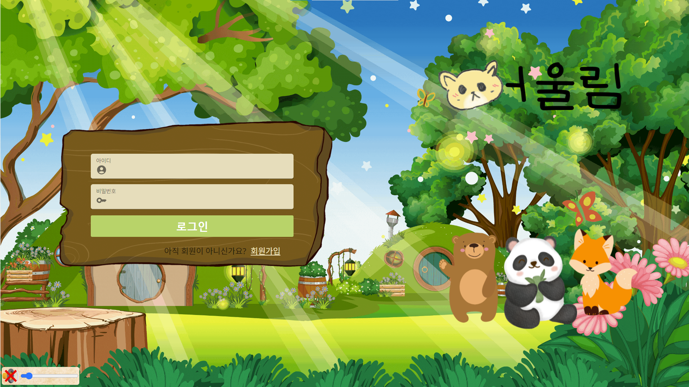
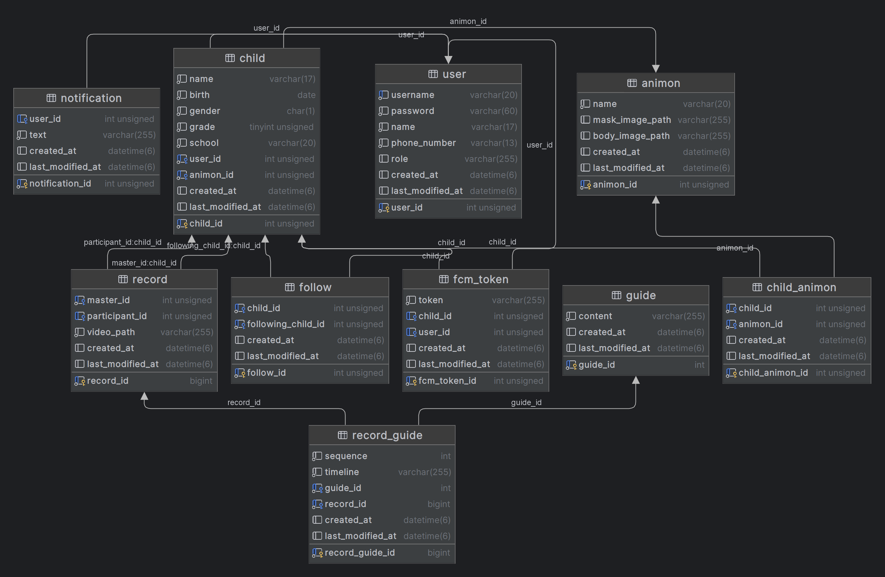

# 자율 프로젝트

## 목차 🚩

[1. 주요 서비스](##-💡-주요-서비스)\
[2. 개발 기간](##-📅-개발-기간)\
[3. 서비스 시연](##-🎪-서비스-시연)\
[4. 팀원 및 역할](##-🤝-팀원-및-역할)\
[5. 주요 기술](##-🛠️-주요-기술)\
[6. 산출물](##-산출물)

# 어울림 2.0 😺

{: width="800" height=""}

📅 프로젝트 기간 : 2023.10.10 ~ 2023.11.17 (7주)

## [어울림 2.0](https://k9c103.p.ssafy.io/)

교외 지역 아이들이 또래 친구를 사귈 수 있는 1:1 랜덤 화상 미팅 서비스

# 어울림 기획 :book:

-   교육통계에 따르면 2023년 신입생이 1명인 곳이 125개교, 3명 이하인 학교가 500여개교 입니다.
-   동네에 또래 친구가 적은 교외 지역 초등학교 1~3학년 아이들을 위한 1:1 랜덤 화상 미팅 기능을 제공합니다.
-   초등학교 선생님들과 학생들을 대상으로 두 번의 설문조사를 진행하여 서비스의 기능을 구체화 했습니다.

# 어울림 소개📄

-   핵심 기능
    -   1:1 랜덤 화상 미팅 기능
    -   아이들의 대화를 유도하는 가이드 기능
    -   아이들의 흥미를 끄는 동물 가면 기능
    -   만났던 친구를 다시 만날 수 있는 초대 기능
    -   부모님의 걱정을 덜어주는 녹화 기능

# 주요 서비스 소개 💡

-   어울림의 주요 서비스를 소개합니다

## 회원 관련 기능 💁🏻‍♂️

|                  회원가입                   |                      모바일 - 회원가입                      |
| :-----------------------------------------: | :---------------------------------------------------------: |
|  |  |
| 회원 정보를 입력한 뒤 회원가입을 진행합니다 |                모바일의 회원가입 화면입니다.                |

-   공공데이터를 활용하여 실제 존재하는 초등학교인지를 확인합니다.
-   회원가입은 보호자 기준으로 진행됩니다.

|                  로그인                   |                     모바일 - 로그인                     |
| :---------------------------------------: | :-----------------------------------------------------: |
|    |  |
| 회원 정보를 입력한 뒤 로그인을 진행합니다 |               모바일의 로그인 화면입니다.               |

-   로그인 후에는 보호자의 자녀 프로필을 선택할 수 있습니다.

## 만남 관련 기능 💁🏻‍♀️💁🏻‍♂️

|                       새 친구 만나기                        |                            모바일 - 새 친구 만나기                            |
| :---------------------------------------------------------: | :---------------------------------------------------------------------------: |
|  |  |
|      랜덤 매칭을 통해 새로운 친구를 만날 수 있습니다.       |                      모바일의 새 친구 만나기 화면입니다.                      |

-   기존보다 개선된 랜덤 매칭 알고리즘을 통해 새로운 친구를 만날 수 있습니다.
-   만남이 끝난 후에는 해당 친구를 나중에 다시 만날 수 있는지 선택할 수 있습니다.
    -   팔로우 - 팔로워 방식으로 상대방은 내가 다시 만나고 싶어하는지를 알 수 없습니다.

|                        예전 친구 만나기                         |                             모바일 - 예전 친구 만나기                             |
| :-------------------------------------------------------------: | :-------------------------------------------------------------------------------: |
|  |  |
|             이전에 만났던 친구를 만날 수 있습니다.              |                       모바일의 예전 친구 만나기 화면입니다.                       |

-   새 친구를 통해 만난 친구를 다시 만날 수 있는 기능입니다.
-   다시 만났던 친구를 만나기에 가이드 기능은 제공되지 않습니다.

|                         캐릭터 가이드                          |                              모바일 - 캐릭터 가이드                              |
| :------------------------------------------------------------: | :------------------------------------------------------------------------------: |
|  |  |
|               캐릭터가 가이드 기능을 제공합니다.               |                        모바일의 캐릭터 가이드 화면입니다.                        |

-   처음 만난 아이와 자연스러운 대화를 할 수 있도록 캐릭터 가이드 기능을 제공합니다.

|                       가면 교환 기능                        |                            모바일 - 가면 교환 기능                            |
| :---------------------------------------------------------: | :---------------------------------------------------------------------------: |
|  |  |
|      새 친구 만나기 이후 상대 친구의 가면을 얻습니다.       |                        모바일의 가면 교환 기능입니다.                         |

-   새 친구를 만나기 전까지는 기본적으로 가면을 2개를 갖고 있습니다.
    -   새 친구를 만난 이후에는 상대방의 가면을 얻을 수 있습니다.

## 알림 서비스 기능

|                       만남 알림 생성                        |                            모바일 - 만남 알림 생성                            |
| :---------------------------------------------------------: | :---------------------------------------------------------------------------: |
|  |  |
|        아이가 미팅을 시작할 경우 알림이 발생합니다.         |                      모바일의 만남 알림 생성 화면입니다.                      |

-   아이가 새 친구와 만남을 시작하거나 예전 친구와 만남을 시작할 경우 부모님께 알림이 가게 됩니다.
    -   알림은 웹과 모바일 모두 네이티브로 알림이 가게 됩니다.

|                       초대 알림 생성                        |                            모바일 - 초대 알림 생성                            |
| :---------------------------------------------------------: | :---------------------------------------------------------------------------: |
|  |  |
|       친구로부터 초대를 받을 경우 알림이 발생합니다.        |                      모바일의 초대 알림 생성 화면입니다.                      |

-   예전에 만난 친구로부터 초대를 받을 경우 알림이 발생하게 됩니다.

## 녹화 기능 :shopping_cart:

|                       녹화 영상 확인                        |                            모바일 - 녹화 영상 확인                            |
| :---------------------------------------------------------: | :---------------------------------------------------------------------------: |
|  |  |
|              녹화 영상 확인을 할 수 있습니다.               |                      모바일의 녹화 영상 확인 화면입니다.                      |

-   부모님의 걱정을 해소해 줄 수 있도록, 아이들의 만남을 확인할 수 있는 녹화 기능입니다.
-   상대 친구의 프로필을 확인할 수 있으며 가이드 대사에 따른 타임라인을 제공합니다.

## 🤝 팀원 및 역할

### 🖌️ FrontEnd

<table align="center">
    <tr align="center">
        <td style="min-width: 150px;">
            <a href="https://github.com/ksungjoon">
              
               
              <b>ksungjoon</b>
            </a>
        </td>
        <td style="min-width: 150px;">
            <a href="https://github.com/blue4683">
              
               
              <b>blue4683</b>
            </a> 
        </td>
        <td style="min-width: 150px;">
            <a href="https://github.com/kingturtle0">
              
               
              <b>kingturtle0</b>
            </a> 
        </td>
    </tr>
    <tr align="center">
        <td>
            김성준
        </td>
        <td>
            안경준
        </td>
        <td>
            오영재
        </td>
    </tr>
</table>

### 🗄️ BackEnd

<table align="center">
    <tr align="center">
        <td style="min-width: 150px;">
            <a href="https://github.com/KoWooMin">
              
               
              <b>KoWooMin</b>
            </a> 
        </td>
        <td style="min-width: 150px;">
            <a href="https://github.com/bnk159hair">
              
               
              <b>bnk159hair</b>
            </a> 
        </td>
        <td style="min-width: 150px;">
            <a href="https://github.com/doluu59">
              
               
              <b>doluu59</b>
            </a> 
        </td>
    </tr>
    <tr align="center">
        <td>
            고우민
        </td>
        <td>
            김하영
        </td>
        <td>
            유연석
        </td>
    </tr>
</table>

## 🛠️ 주요 기술

### 🔧 BackEnd

Spring Boot, JPA, QueryDSL, Spring Security, Firebase

### ⚛️ FrontEnd

React.js, ReactQuery, TypeScript, Tailwind

### 📱 Mobile

Flutter, GetX

### ☁️ InfraStructor

AWS, Nginx, Docker, Jenkins

### 🔐 Authencation

JWT, Redis

### 💬 Collaborate

GitLab, Jira, Figma, Notion

### 🌟 Etc

공공데이터 API,

## 산출물

### 🏗️ 아키텍쳐 구조도

### 🗃️ ERD

